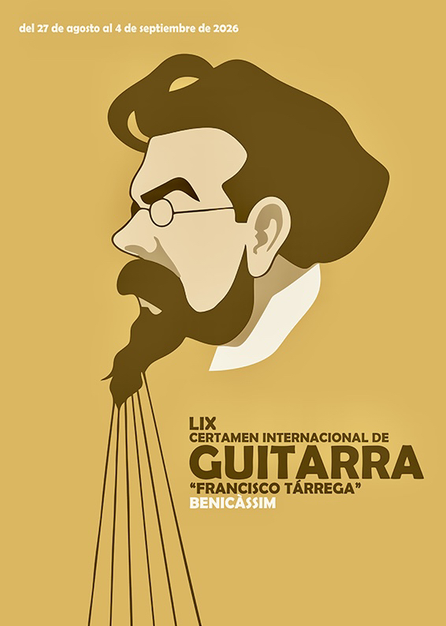

# 弹拨乐一周简报（2026.08.23—08.29）
# 编辑导语
> 本周，国际古典吉他赛事进入暑期赛季密集期，伦敦国际中国音乐节、塔雷加国际吉他比赛等活动相继展开；国内则有“敦煌杯”、保利（天津）国乐艺术节等赛事与活动收官。舞台方面，王健与约兰·索舍尔（Göran Söllscher）9月上海同台的消息公布，国际品牌新品、智能无弦吉他以及月琴等传统乐器的当代表达也带来新的行业动态。

---

# **艺术节、赛事与学术动态**

### 第59届塔雷加国际吉他比赛（LIX Certamen Internacional de Guitarra Francisco Tárrega）在西班牙开赛

- 第59届弗朗西斯科·塔雷加国际吉他比赛于8月27日在西班牙贝尼卡西姆（Benicàssim）正式开赛。本届共有来自10个国家的19名35岁以下青年选手入围，预选赛于8月28日至29日举行，半决赛安排在8月31日至9月2日，决赛将于9月4日晚在市立剧院举行。

  同期还安排“塔雷加日”专场以及2025年冠军阿尔瓦罗·托斯卡诺（Álvaro Toscano）的独奏音乐会。

### 第四届伦敦国际中国音乐节（London International Chinese Music Festival）举行

- 第四届伦敦国际中国音乐节于8月24日至28日在伦敦大学亚非学院（SOAS）举行，主题为“东方之声在西方”（Sounds of the East in the West）。活动包括暑期学校、大师班、工作坊、考级与比赛，以及《自然之声》（Sound of Nature）等音乐会，涉及古琴、琵琶、古筝、阮、三弦等中国传统弹拨乐器。

### 第二届“敦煌杯”中国弹拨乐演奏比赛北京收官

- 2026第二届“敦煌杯”中国弹拨乐（琵琶/阮/柳琴）演奏比赛于8月9日至14日在北京举行，本周发布赛事收官信息。比赛覆盖琵琶、阮、柳琴三个乐器门类，设置职业组、业余组及多个青少年组别。

  闭幕式颁奖音乐会公布各组别获奖名单，并有老中青三代弹拨乐名家登台演绎经典作品。

### 第36届维也纳论坛吉他艺术节（Forum Gitarre Wien）开幕

- 第36届维也纳论坛吉他艺术节于8月28日在维也纳音乐厅舒伯特厅（Wiener Konzerthaus, Schubert Saal）开幕，本届主题为纪念吉他大师罗伯托·奥塞尔（Roberto Aussel）。开幕音乐会由艾略特·菲斯克（Eliot Fisk）与雅各布·哈胡拉（Jakub Chachura）联袂演出。

  艺术节持续至9月3日，内容涵盖音乐会、比赛、大师班、讲座以及制琴展览。

### 第24届特兰西瓦尼亚国际吉他艺术节（Transilvania International Guitar Festival）举行

- 第24届特兰西瓦尼亚国际吉他艺术节于8月26日至30日在罗马尼亚克卢日-纳波卡（Cluj-Napoca）举行。活动包括客座大师音乐会、古典吉他比赛，其中设有“米哈伊·巴比伊”（Mihai Babii）与“杜米特鲁·卡波亚努”（Dumitru Capoianu）两个比赛项目。

### 第六届阿罗约·德·拉·卢斯国际吉他艺术节（VI Festival Internacional de Guitarra Arroyo de la Luz）展开

- 第六届阿罗约·德·拉·卢斯国际吉他艺术节自8月23日起在西班牙埃斯特雷马杜拉地区多个市镇举行，共安排八场免费音乐会，嘉宾包括里卡多·加连（Ricardo Gallén）等。

  艺术节同时设置8月24日至31日的吉他营（Campus de Guitarra）以及青少年演奏比赛，并为当地音乐学院优秀学生提供大师班奖学金。

### 第二届广西古琴文化艺术节举行

- 8月23日，以“丝路古韵·非遗传承”为主题的2026第二届广西古琴文化艺术节在广西音乐厅举行。活动汇聚古琴演奏家及非遗代表性传承人，设置广西古琴名家音乐会、琴谱打谱沙龙、非遗进校园等项目。

---

# **乐器制作、非遗与文化动态**

### Guitar Center推出2026“Crossroads Guitar Collection”![[IMG_3087.webp]]

- 美国乐器零售商Guitar Center于8月27日公布2026年度“Crossroads Guitar Collection”。系列包括多款限量吉他，其中Martin Custom Shop 000-42 Eric Clapton Brazilian全球限量5把，售价24999.99美元。

### Gibson推出Victory Baritone吉他

- Gibson于8月25日发布Victory Baritone，将Victory系列扩展至28英寸弦长的Baritone吉他领域，并采用ELEV8双线圈拾音器，针对低音域及降调演奏进行设计。

### 唐农（Donner Music）发布智能无弦吉他DONNER VIVA

- 广州乐器品牌唐农推出智能无弦吉他DONNER VIVA，以触控方式取代传统琴弦与指板，并通过数字音频处理实现弹唱及多轨“乐队模式”等功能。

### 《沙湾往事》主创团队回到沙湾寻找粤乐源流

- 8月25日，大型原创舞剧《沙湾往事》主创、主演团队走进广州番禺沙湾古镇开展“溯源行”文化对话。广东音乐项目非遗代表性传承人何滋浦现场介绍何氏音乐家族及广东音乐的传承脉络。

  该剧以“何氏三杰”等广东音乐人为创作原型，以《赛龙夺锦》的创作故事为主线，并于8月7日至8日在广州大剧院开启2026—2027年度全国巡演。

### 月琴登上台北捷运，重现“那卡西”音乐传统

- “2026新北投车站捷运那卡西——潮·月琴”于8月29日至9月6日期间举行，由台北捷运与台湾月琴民谣协会合作，在北投至新北投列车上进行月琴现场弹唱。

  活动曲目包括《四季红》《雨夜花》以及恒春、满州民谣，并加入电吉他与月琴的跨界演出。

---

# **音乐会、展会展演与乐团动态**

### 王健与约兰·索舍尔（Göran Söllscher）9月上海首度中国内地同台【预告】![[IMG_3050 1.jpeg]]

- 大提琴家王健与瑞典吉他大师约兰·索舍尔将于9月26日在上海东方艺术中心首度中国内地同台。两人将重现2007年DG专辑《Reverie》的部分曲目，并演奏舒伯特《阿佩乔尼奏鸣曲》以及皮亚佐拉等作品。

### 伍德斯托克首届指弹吉他节（Woodstock Fingerstyle Guitar Festival）举行

- 首届伍德斯托克指弹吉他节于8月28日至30日在美国纽约州伍德斯托克举行。活动包括比赛、工作坊、厂商展览及多场音乐会，演出阵容包括加雷思·皮尔森（Gareth Pearson）、亚历山大·米斯科（Aleksandr Misko）、广谷塚本（Hiroya Tsukamoto）等。

### 皮埃尔·本苏三（Pierre Bensusan）中国巡演继续

- 法籍阿尔及利亚裔指弹吉他大师皮埃尔·本苏三的2026中国巡演本周继续进行，8月28日成都、8月29日广州、8月30日深圳均安排演出，并配套举办大师课。

### 中央民族乐团《印象国乐》清华大学连演三晚

- 8月22日至24日，中央民族乐团《印象国乐》在清华大学新清华学堂连续演出三晚。演出融合民族音乐会、舞台剧以及观念艺术、行为艺术等形式。

  演出入场前，箜篌、古琴、中阮等乐器演奏家在剧场入口区域进行现场演奏。

### 中央民族乐团9月赴深圳连演三场【预告】

- 深圳市南山区“民乐演出汇”将于9月24日至26日在深圳保利剧院举行。中央民族乐团将连续三晚带来《印象·又见国乐》《和乐沐清辉》《泱泱国风》三场不同主题音乐会。

---

# **人物资讯**

### 韩国摇滚吉他手崔具熙（Choi Gu-hee）去世
![[IMG_3088.webp]]

- 韩国经典摇滚乐队野菊花（Deulkukhwa）吉他手崔具熙于8月25日去世，享年67岁。他曾长期活跃于韩国1980年代摇滚音乐场景，野菊花被视为韩国流行音乐史上具有重要影响力的乐队之一。

### 莱斯·保罗（Les Paul）故居与工作室保护问题再次受到关注

- 美国传奇吉他手、发明家莱斯·保罗位于新泽西州马瓦（Mahwah）的故居及工作室近期因拆除问题再次受到关注。相关影像显示，这一与现代电吉他发展史有关的空间已经严重破败。

---

# **本周值得一听（Editor's Pick）**

### 《Reverie》（2007）——王健（Jian Wang）× 约兰·索舍尔（Göran Söllscher）

- 在两人即将于9月26日上海同台之际，可以重温二人2007年合作的DG专辑《Reverie》。专辑收录皮亚佐拉、法雅等作品，也为即将举行的上海演出提供了很好的聆听入口。