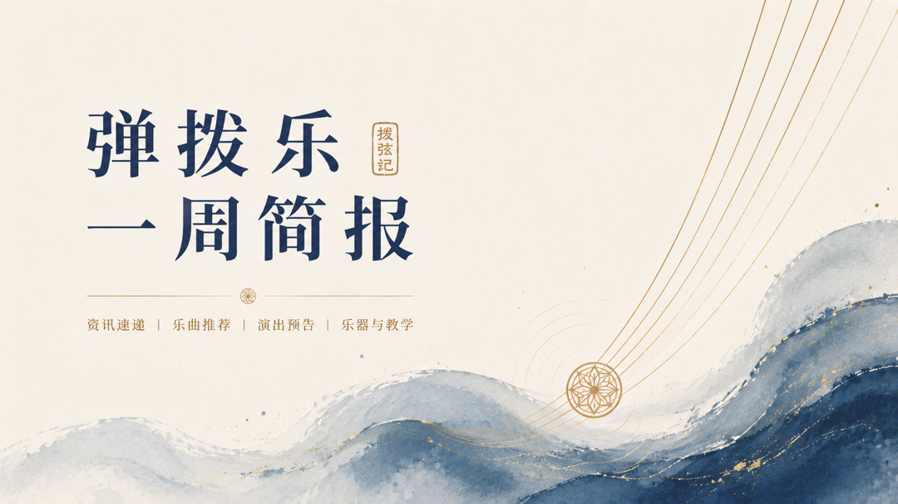
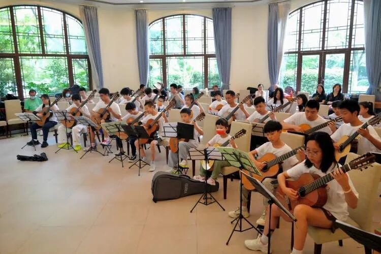
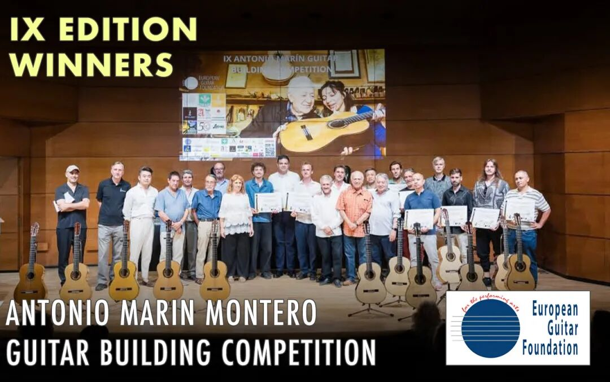
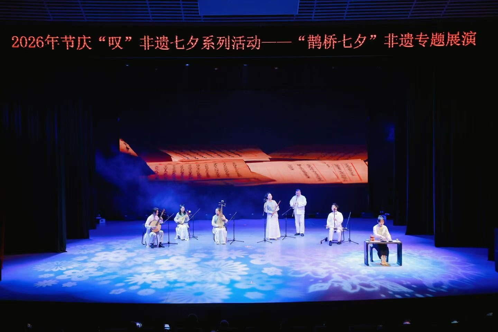
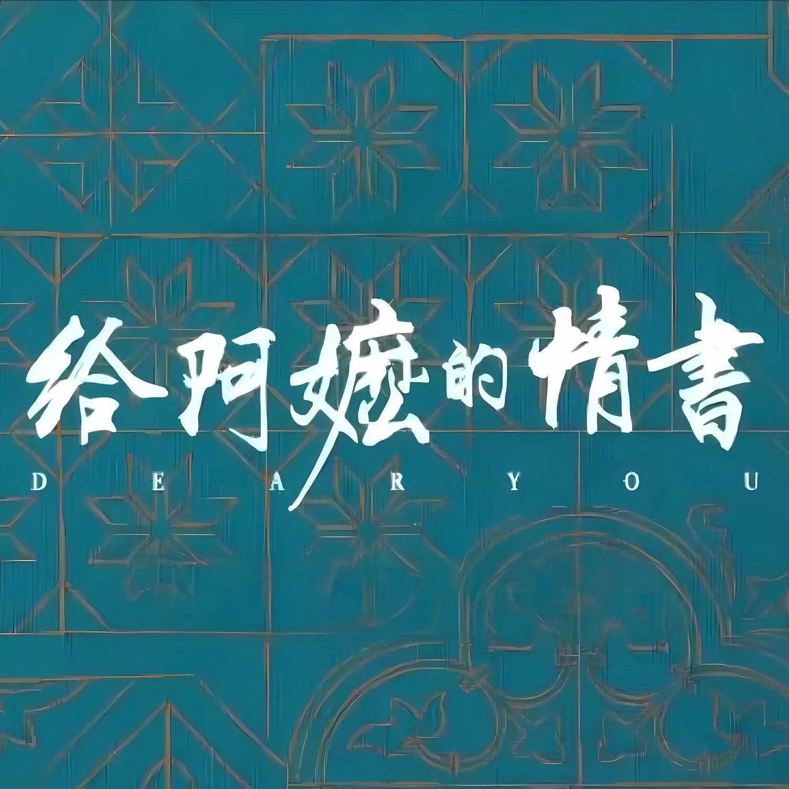

# 弹拨乐一周简报
## （2026.08.15—08.22）

## 编辑导语

> 白玉兰国际音乐节首次设立民族弹拨乐协奏曲专项奖项，成为本周最值得关注的行业信号。与此同时，欧洲、美洲、亚洲多地吉他艺术节、国际赛事与制琴展密集举行，弹拨乐领域呈现出专业赛事深化、跨界演出拓展与传统文化持续活化并行发展的态势。

---

## **艺术节、赛事与学术动态**

- **第三届乌镇国际吉他夏令营（Meng·Sheng International Guitar Summer Camp）举办跨界音乐会。** 苏萌（Su Meng）担任艺术总监，王雅梦（Wang Yameng）、许拓（Xu Tuo）、李洁（Li Jie）、亚历山大·谢尔盖·拉米雷斯（Alexander Sergei Ramírez）、伊格纳西奥·罗德斯（Ignacio Rodes）等中外演奏家参与大师班与重奏课程，期间《六弦·水色》音乐会以古典吉他二重奏结合现代舞完成跨界舞台呈现。

- **白玉兰国际音乐节首次设立民族弹拨乐协奏曲专项奖项。** 第八届白玉兰国际音乐节民族弹拨乐协奏曲总决赛暨音乐会于8月20日在上海音乐学院贺绿汀音乐厅举行，中阮、古筝、琵琶、扬琴四大专项奖项首次设立，12名选手与浙江民族乐团合作竞演《苍歌引》《云想花想》《山韵》《狂想曲》等作品，音乐节同期举办古琴原创作品研讨等学术活动。

- **塔雷加国际吉他比赛（Certamen Internacional de Guitarra Francisco Tárrega）公布完整赛程。** 第59届赛事将于8月27日至9月4日在西班牙贝尼卡西姆（Benicàssim）举行，共有来自10个国家的19名35岁以下青年演奏家入围。

- **西迪恩国际古典吉他艺术节（West Dean International Classical Guitar Festival）汇聚国际演奏家。** 英国西迪恩学院（West Dean College）举办大师班与音乐会，SoloDuo（洛伦佐·米凯利 Lorenzo Micheli、马泰奥·梅拉 Matteo Mela）、拉斐拉·斯米茨（Raphaella Smits）、劳拉·斯诺登（Laura Snowden）等演奏家参与授课与演出。

- **芝加哥指板峰会（Fretboard Summit）聚焦制琴与演奏交流。** 《Fretboard Journal》联合老城民谣音乐学校（Old Town School of Folk Music）举办行业音乐会、大师班及北美中西部大型独立制琴师作品展。

- **阿罗约德拉卢斯国际吉他艺术节（Festival Internacional de Guitarra de Arroyo de la Luz）开启巡回系列活动。** 西班牙第六届艺术节巡回六座城镇，并同步举办青少年竞赛与常态化大师班。

- **图迪尼国际古典吉他艺术节（Festival international de guitare classique en Thudinie）举办青年演奏家专场。** 比利时艺术节由约翰·福斯捷（Johan Fostier）担任艺术指导，欧洲多国青年演奏家同台展演。

- **山口吉他大赛公布最终评审结果。** 日本第54回山口吉他大赛中，安部晴美（Harumi Abe）获高级组金奖，山田真菜（Mana Yamada）获大奖部门第一名。

- **吉他基金会国际演奏家大赛（Guitar Foundation of America International Concert Artist Competition）公布年度大奖。** 美国演奏家埃里克·王（Eric Wang）获得罗斯·奥古斯丁大奖（Rose Augustine Grand Prize），盖伊·赫希伯格（Guy Hirschberger，以色列）与蒂莫泰·维努尔（Timothée Vinour，法国）分获第二、第三名。

- **温哥华古典吉他艺术节（Vancouver Classical Guitar Festival）邀请普霍尔开设大师班。** 阿根廷作曲家、吉他演奏家马克西莫·迭戈·普霍尔（Máximo Diego Pujol）举办大师班与独奏音乐会。

- **西澳古典吉他艺术节（Western Australia Classical Guitar (Ensemble & Solo) Festival）持续推动青少年培养。** 澳大利亚赛事设置独奏、合奏竞赛，覆盖青少年演奏群体。

- **哈尔滨扬琴艺术节行业复盘持续发酵。** 首届哈尔滨扬琴艺术节暨第六届中国扬琴艺术节汇聚近千名专家、教师与青年选手，中国香港、中国澳门、中国台湾扬琴团体共同参与交流展演。

- **鲁台青年诸城派古琴交流雅集举办。** 两岸琴家共同演绎《关山月》《流水》《客窗夜话》等古曲，并开展青年琴手交流与文化沙龙。

- **《梧冈琴谱》文化价值研讨会聚焦古谱研究。** 杭州西湖琴社举办第二届研讨交流会，围绕明代《梧冈琴谱》的校勘、指法复原与当代传承展开讨论。

- **山海之约国际艺术周完成民族器乐展演终评。** 大连赛事覆盖琵琶、阮等民族弹拨乐器青年选手选拔。

- **“湾韵和鸣”青年粤乐创作活动启动全球征集。** 活动面向全球创作者征集粤语词曲与岭南器乐原创作品。

- **第四届伦敦国际中国音乐节（London International Chinese Music Festival）即将举办。** 伦敦大学亚非学院（SOAS）将举办古琴、琵琶大师班及国际竞赛，主题为“东方之声在西方”。

---

## **乐器制作、非遗与文化动态**

- **安东尼奥·马林·蒙特罗国际吉他制作大赛（Concurso Internacional de Construcción de Guitarras Antonio Marín Montero）公布赛果。** 第九届赛事在西班牙格拉纳达举行，中国制琴师小蒋与意大利制琴师莱奥波尔多·巴贝里斯（Leopoldo Barberis）并列古典吉他组三等奖，弗朗切斯科·巴卡廖内（Francesco Baccaglion）获古典组冠军，雅各布·比勒（Jakob Biehler）获弗拉门戈组冠军。

- **现代吉他社（Gendai Guitar／現代ギター社）举办夏季古典吉他展销会。** 日本现代吉他社举办乐器展、制琴工具与材料专题展，并开放预约制试奏活动。

- **九江“无弦琵琶”紫铜雕塑意外走红。** 降雨积水形成天然“水弦”视觉效果，结合《琵琶行》文化典故带动文旅热度，日均吸引大量游客。

- **陈雷激分享原创古琴教学体系。** 中央音乐学院古琴教授在上海举办专题分享会，系统介绍“雷激古琴教学法”。

---

## **音乐会、展会展演与乐团动态**

- **七夕非遗专场融合器乐、戏曲与茶艺。** 广东省非物质文化遗产馆举办《鹊桥七夕》专题展演，《月下煮茶》由尊岭之秀乐团与非遗茶艺共同呈现，成为全场高潮。

- **尊岭之秀乐团公布近期演出动态。** 乐团完成深圳音乐厅《四时风雅》公益音乐会，并于广州科学城瑜源剧场举办《爱在七夕夜》国潮音乐会。

- **广东民族乐团开展乡村惠民巡演。** “艺路轻骑”走进韶关始兴，持续推进基层公益演出。

- **南达兹国际古典吉他艺术节（Nendaz International Classical Guitar Festival）完成收官演出。** 瑞士第22届艺术节由多梅·佐尔陶伊（Döme Zoltai）与雅库布·巴赫莱达-谢利加（Jakub Bachleda-Szeliga）联袂收官。

- **“荒野中的古典吉他”（Wilder Frets: Classical Guitar in the Wilderness）持续户外巡演。** 美国俄勒冈州系列音乐会将在州立公园持续演出至10月。

- **国际曼陀铃吉他学院艺术节（International Mandolin/Guitar Accademia）举办高阶研修。** 意大利皮埃蒙特艺术节聚焦曼陀铃、古典吉他教学与学术交流。

- **克罗地亚曼陀铃世界研修营（Mandolin World Retreat）即将开营。** 卡特琳娜·利希滕贝格（Caterina Lichtenberg）与迈克·马歇尔（Mike Marshall）联合执教，面向全球职业演奏家与教师。

- **卢卡啤酒花园吉他艺术节（Lucca Beer Garden Guitar Festival）举办公益演出。** 北美青年吉他演奏家在户外连续举办公益音乐会。

- **山东文艺广播推出夏季国风特辑。** 《高雅音乐工程》节目收录古琴、琵琶、广东音乐等作品，持续开展民乐美育传播。

- **“古琴 on the way”公共文化活动持续开展。** 上海百联西郊举办虞山吴派古琴常态化展演，活动持续至9月19日。

---

## **本周值得一听（Editor's Pick）**

### 《月下煮茶》（电影《给阿嬷的情书》主题曲）

- **推荐理由。** 本周七夕非遗展演中，《月下煮茶》以器乐、声乐与潮州工夫茶艺的融合呈现，成为尊岭之秀乐团近期演出的代表性舞台，也呼应了本周“传统文化活化”这一重要趋势。