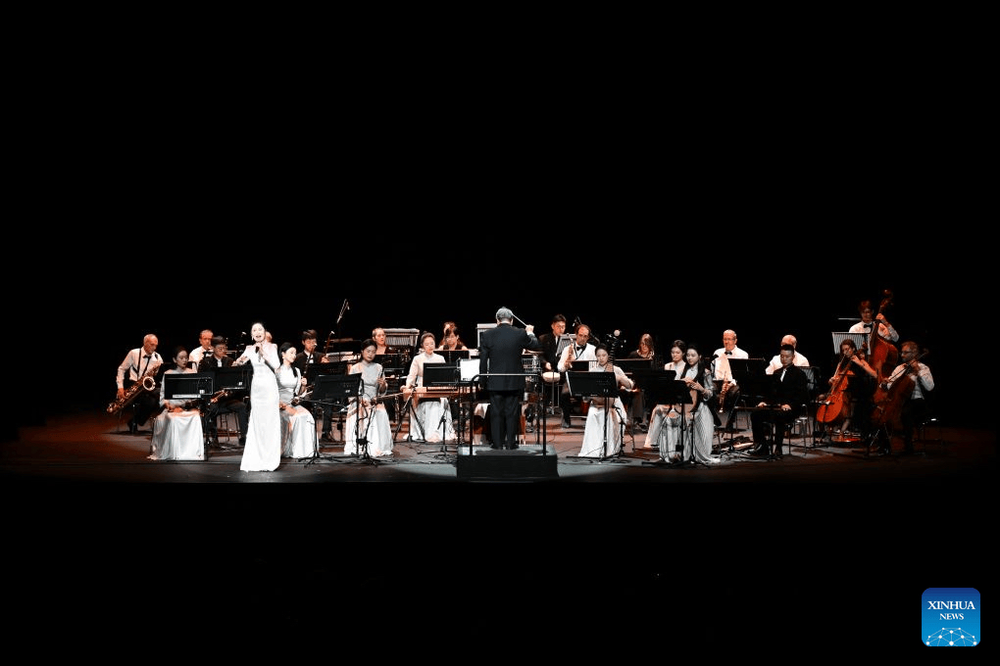
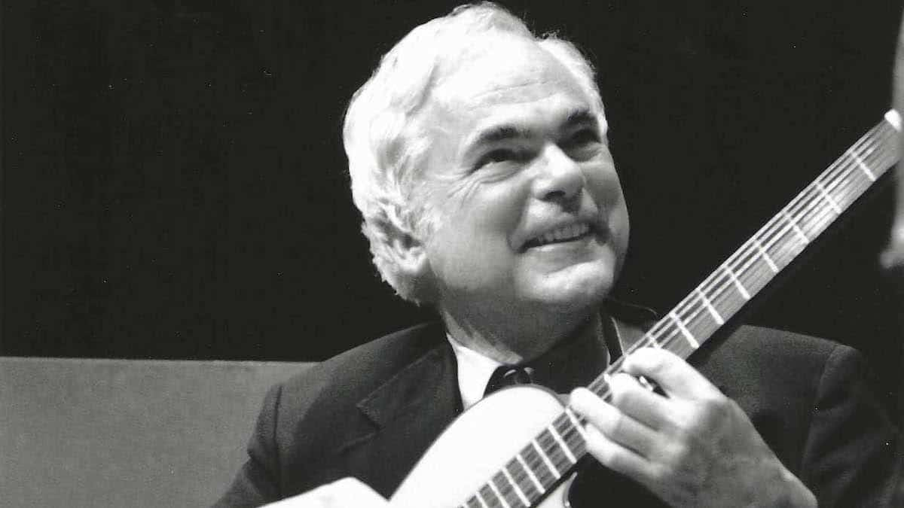
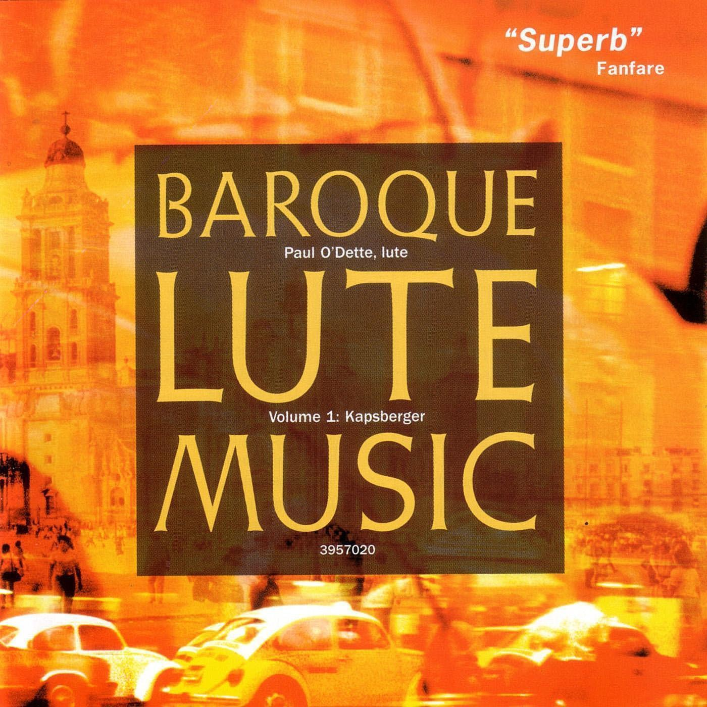

# 弹拨乐一周简报
## （2026.08.30—09.05）

## 编辑导语

> 本周，国际吉他舞台迎来塔雷加国际吉他大赛冠军诞生，SatchVai正式公布首张合作录音室专辑；中国方面，《千里潇湘》欧洲巡演从日内瓦启程，上海民族乐团《国乐咏中华》亮相北京，正安吉他产业也因法新社专题报道再次进入国际视野。从舞台到工坊，弹拨乐正以不同方式持续扩大影响力。

---

## **艺术节、赛事与学术动态**

- **克罗地亚选手 Filip Mišković 获得第59届塔雷加国际吉他大赛冠军。** 第59届弗朗西斯科·塔雷加国际吉他大赛（LIX Certamen Internacional de Guitarra Francisco Tárrega）于9月4日在西班牙贝尼卡西姆（Benicàssim）完成决赛。克罗地亚选手 Filip Mišković 获得一等奖，同胞 Luka Lovreković 获二等奖。作为欧洲历史最悠久的古典吉他赛事之一，本届继续要求决赛选手演奏罗德里戈协奏曲等重要曲目。

- **乌得勒支早期音乐节进入尾声，鲁特琴仍是重要节目内容。** 荷兰乌得勒支早期音乐节（Festival Oude Muziek Utrecht）于8月28日至9月6日举行，本届主题为“Giving Voice”，节目涵盖中世纪、文艺复兴和巴洛克音乐，并安排多场鲁特琴及其他历史弹拨乐器演出。

- **危地马拉首届全国吉他节完成演出与教学活动。** 8月31日至9月3日，危地马拉国家音乐学院举办首届全国吉他节（Festival Nacional de Guitarra），活动涵盖大师课、合奏工作坊、吉他保养课程及音乐会，成为当地吉他教育的重要年度活动。

---

## **乐器制作、非遗与文化动态**

- **贵州正安吉他产业获法新社专题报道。** 法新社于8月31日推出专题报道，关注贵州正安从山区县城发展为“中国吉他之都”的产业路径。报道指出，当地已形成覆盖制琴、配件、品牌与出口的完整产业链，每年生产约250万把吉他，产品销往40多个国家和地区，是本周国际媒体关注度最高的中国弹拨乐产业新闻之一。

- **Ibanez集中发布多款签名型号扇品吉他新品。** 品牌于9月初推出Steve Vai、Joe Satriani、Nita Strauss等艺术家签名型号，并发布七弦扇品吉他Iceman ICMS721，继续强化高性能电吉他产品线。

- **Gibson推出Billy Gibbons“Pearly Gates”限量复刻版。** Gibson Custom以Billy Gibbons的1959年Les Paul“Pearly Gates”为原型推出Collector's Edition，全球限量30把，并采用Murphy Lab做旧工艺。

---

## **音乐会、展会展演与乐团动态**

- **《千里潇湘》在日内瓦首演，开启欧洲五国巡演。** 湖南省演艺集团出品的新民乐作品《千里潇湘》于8月30日在瑞士日内瓦BFM剧院首演，随后开启覆盖瑞士、法国、奥地利、英国和德国的巡演，是国家艺术基金2026年度传播交流推广项目。

- **上海民族乐团《国乐咏中华》完成北京三场演出。** 9月2日至4日，《国乐咏中华》亮相第七届全国少数民族文艺会演，以五个乐章串联中华文明叙事，并运用琵琶、中阮、箜篌等弹拨乐器与多民族乐器共同构建音响层次。

- **《岭南秀女》民乐唱片入藏广州图书馆，尊岭之秀乐团举办作品鉴赏会。** 8月27日，广州图书馆举办《岭南秀女》民乐作品鉴赏会，并正式收藏这张民族器乐唱片。乐团主创团队现场介绍创作理念、赏析作品，这是岭南民乐作品进入公共文化收藏体系的一次有代表性的实践。

- **香港中乐团《港韵乐蜀》9月5日在成都上演。** 音乐会由肖超执棒，琵琶首席张莹演奏《霸王卸甲》，并演出《蜀宫夜宴》《唐响》等作品，是“香港周2026@成都”的重点音乐项目。

- **方锦龙《国乐添香·秋之魅》9月5日登陆北京正乙祠。** 方锦龙携戴音、程洪宇、于东波等音乐家登台，以五弦琵琶、阮、古琴、箫等传统乐器呈现秋日国乐专场，并同步举行新书签售活动。

- **Tommy Emmanuel《The Mystery》20周年重制版正式发行。** 澳大利亚指弹吉他演奏家 Tommy Emmanuel 于9月4日推出经典专辑《The Mystery》20周年重制版，新增此前未发行的现场版《What a Wonderful World》，北美巡演也将于近期展开。

- **SatchVai公布首张合作录音室专辑，《Mayhem》同步上线。** Joe Satriani 与 Steve Vai 正式公布合作专辑《The Sea of Emotion》，并于本周推出首支单曲《Mayhem》。这是两位吉他大师首次以“SatchVai”名义推出完整录音室作品。

---

## **人物资讯**

- **爵士吉他大师 Gene Bertoncini 去世，享年89岁。** 美国爵士吉他演奏家 Gene Bertoncini 于8月29日去世，新泽西爵士协会于9月1日发布讣告。他曾与Benny Goodman、Buddy Rich、Wayne Shorter等音乐家合作，以细腻的和声语言和尼龙弦吉他演奏风格闻名。

---

## **拨弦听曲｜本周值得一听**

### *Mayhem*

- **推荐理由。** 作为SatchVai合作专辑《The Sea of Emotion》的首支单曲，《Mayhem》浓缩了Joe Satriani与Steve Vai跨越五十余年的音乐交流成果。从师生关系到首次完整合作录音室专辑，这首作品既是本周最值得关注的新作，也是现代电吉他发展史上的重要节点。

---

## 关于拨弦记

《拨弦记》持续关注世界弹拨乐领域的艺术节、赛事、学术、乐器制作、非遗、音乐会及人物资讯。

- 主理人网站：guitarkk.com
- GitHub：keenkwok.github.io/boxianji/
- 微信公众号：拨弦记
