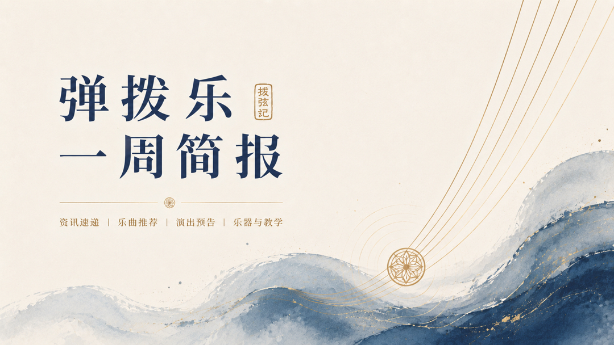

# 弹拨乐一周简报
## （2026.09.27—10.03）

## 编辑导语

> 本周关键词是中秋国庆档。郑州汇聚泛箜篌类名家，上海民族乐器文化展将敦煌仿古弹拨与限量联名乐器搬进展厅；德国 Guitar Summit 于 9 月 27 日收官，塞维利亚弗拉门戈双年展亦在近期落幕。王中山《望故乡》转战无锡、郑州，香港彈樂庆十五载，朴葵姬连走台中、台北；曼谷亚洲国际吉他节与保加利亚 GuitArt 同期开幕，大阪 ARTE 曼陀林节、塞维利亚吉他节接棒。阿努什卡·香卡“Chapters Tour”即将在京沪穗上演，米洛什秋季行程因健康原因出现调整。

---

## 近期重要演出






  
  - **🎫 {{ event.date }}｜{{ event.city }}**｜[查看详情]({{ event.link }})  
  **{{ event.title }}**
  


更多近期演出：**《拨弦记》演出情报**
[https://boxianji.guitarkk.com/attention/](https://boxianji.guitarkk.com/attention/)

---

## **艺术节、赛事与学术动态**

- **第 26 届亚洲国际吉他节于 10 月 2–4 日在曼谷举行。** 地点为 Yamaha Ratchadapisek 音乐学校礼堂，设有大师课、乐器展及公开组、青少年组、少儿组比赛；保罗·加尔布雷思（Paul Galbraith）、菲利普·维拉（Philippe Villa）、莱昂·库德拉克（Leon Koudelak）等参加，2 日为 25 周年庆典音乐会，3 日为加尔布雷思独奏。
- **第十届 GuitArt 国际吉他节 10 月 1–4 日在保加利亚普罗夫迪夫举行。** 节目含音乐会与国际古典吉他比赛（决赛 10 月 4 日），亚曼杜·科斯塔（Yamandu Costa）亦将亮相。
- **第 13 届 ARTE 国际曼陀林音乐节暨比赛将于 10 月 10–11 日在日本大阪举行。** 曼陀林作为弹拨谱系中的重要品种，本场是东亚地区近期最集中的曼陀林专业活动。
- **塞维利亚吉他节 10 月 5 日至 11 月 7 日开幕。** 以曼努埃尔·德·法雅诞辰 150 周年为主题，古典与弗拉门戈并行，法比奥·扎农（Fabio Zanon）、卡莱斯·特雷帕特（Carles Trepat）等在列。
- **第 24 届塞维利亚弗拉门戈双年展于 10 月 3 日收官。** 9 月 9 日起共 72 场，图里纳空间 9 月 11–27 日集中安排吉他专场，安东尼奥·雷伊、拉斐尔·里基尼、胡安·曼努埃尔·卡尼萨雷斯、迭戈·德尔·莫拉奥等悉数登场。
- **第 20 届国际西里西亚吉他秋季音乐节开幕音乐会定于 10 月 17 日。** 马尔钦·迪拉（Marcin Dylla）将与 Ewa Jabłczyńska、Dariusz Kupiński 共同演奏 José María Sánchez-Verdú 为三把吉他与弦乐团创作的《La Nave de Teseo》，该作品将在音乐节中进行世界首演。
- **智利圣地亚哥“Guitarras en Travesía”自 9 月 30 日起至 10 月 28 日。** 每周三晚在 GAM 举行，10 月 7 日为南方四重奏（吉他与弦乐四重奏），收官场由刚获 2026 年智利国家音乐艺术奖的路易斯·奥兰迪尼与拉伊蒙多·卢科二重奏承担。
- **路易斯维尔吉他节 10 月 9–11 日即将举行。** 地点为路易斯维尔大学音乐学院，设有公开组、高校组与青少年组比赛及讲座。

---

## **乐器制作、非遗与文化动态**

- **上海“音符里的故事——2026 年民族乐器文化展”持续至 10 月 7 日。** 9 月 24 日在昌硕文化中心开幕，由闵行区文旅局与上海民族乐器一厂主办。展品含高德祥主导的“乐鸣敦煌”系列：凤首箜篌、曲颈琵琶、五弦花型曲颈大阮等；另有刘德海、高占春 80 寿诞限量琵琶，何占豪九十生辰“耄耋童心”联名古筝，常沙娜“乐舞之神”古筝，以及敦煌×故宫“闻喜声声事如意”“迭花流金”、敦煌×老凤祥“茶娇玉妍”系列。
- **江南丝竹秋季雅集 9 月 23 日夜场走进上海古籍书店。** “雅韵知秋·花好月圆”为首个书店夜场雅集，琵琶、扬琴与笛箫二胡同台；光明中学民乐队以琵琶、古筝演奏《送我一枝玫瑰花》，并与手风琴合作《紫竹调》《喜洋洋》。
- **德国 Guitar Summit 9 月 25–27 日在曼海姆 Rosengarten 落幕。** 第八届、约 600 家参展，四层展区覆盖电吉他、原声、贝斯、音箱与效果器；安迪·麦基、马泰奥·曼库索、玛丽·斯彭德等参与工作坊与夜间音乐会，是本周欧洲制琴与配件最集中的盛会。
- **阿根廷 La Costa 连续第三年承办“世界吉他”节分会场。** 10 月 1 日在 Mar de Ajó 海洋剧院举行，艺术总监胡安·法卢，向罗伯托·奥塞尔致敬；俄罗斯吉他家阿纳斯塔西娅·巴尔迪娜、卡洛斯·莫斯卡迪尼与当地四位制琴师同场，演奏家现场试琴。

---

## **行业动态**

- **国庆档弹拨音乐会轮番上演。** 10 月 1 日东莞博物馆“国乐礼赞”国庆民乐音乐会（尊岭之秀乐团）；10 月 3 日无锡、10 月 5 日郑州为王中山“敦煌国乐·望故乡 2026”，编制含古筝与三弦；10 月 5 日北京自得琴社《战汉·启元》国风户外场，古琴、古筝、中阮、琵琶同台。
- **港澳台弹拨专场集中在周末。** 10 月 4 日香港“彈樂·作樂多端十五載”以柳琴、中阮为主；朴葵姬吉他独奏 10 月 4 日台中、10 月 5 日台北连演。此前 9 月 27 日，台北已有《流金岁月·曼陀林群星会》。
- **清华大学艺术教育中心举办“美育浸润·弦系未来”未来之星古典吉他名家师生音乐会。** 延续校园与职业名家对接的古典吉他教育路径。
- **阿努什卡·香卡西塔琴“Chapters Tour”进入中国大陆巡演窗口。** 10 月 14 日北京、16 日上海、18 日广州连续三站，编制含西塔琴、单簧管、低音提琴与打击乐。
- **上海国际乐器展仍是月内产业节点。** Music China 定于 10 月 28–31 日，覆盖民族弹拨全产业链，适合与本周上海乐器文化展对照着看制琴与联名文创。

---

## **人物资讯**

- **马尔钦·迪拉（Marcin Dylla）将于 10 月 17 日在西里西亚吉他秋季音乐节开幕音乐会上，与两位搭档共同完成《La Nave de Teseo》的世界首演。
- **拉斐尔·费乌伊特拉（Raphaël Feuillâtre）10 月 9 日参加“Roland Dyens in the Skaï”吉他节。** 该项目为其近期欧洲巡演的重要节点，随后还将进入美国巡演。
- **米洛什（Miloš Karadaglić）的秋季演出出现调整。** 英国 Saffron Hall 原定 10 月 3 日举行的 Miloš 与手风琴家 Ksenija Sidorova 音乐会已经取消，主办方说明 Miloš 因健康原因需进一步治疗，退出秋季演出。
- **路易斯·奥兰迪尼获 2026 年智利国家音乐艺术奖。** 10 月 28 日将与拉伊蒙多·卢科在圣地亚哥以德国作品与键盘改编收官“Guitarras en Travesía”，曲目含巴赫《托卡塔》BWV 914，其近期 Naxos 唱片亦收录智利与拉美作品。。